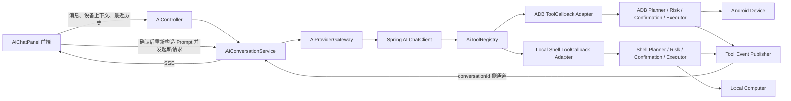
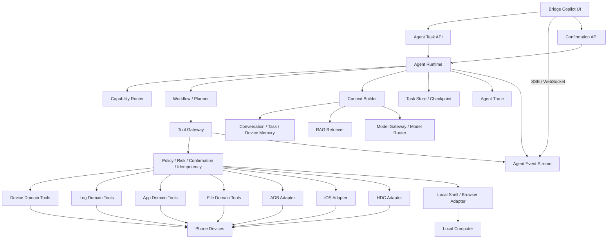

# 技术预研：Ai DevBridge 当前 AI 助手架构评估

## 1. 预研结论

- 结论：当前架构作为“本地工具调用型 AI 助手”是合理的，作为“能够可靠完成跨手机与电脑复杂业务任务的 Agent 平台”仅部分合格。
- 综合评价：约 5.0/10。基础执行层和安全边界方向较好，但 Agent 控制平面、Memory、任务状态、平台路由、资源治理、数据安全和标准 MCP 能力不足。
- 推荐方案：保持 Spring Boot 模块化单体，新增后端 `Agent Runtime` 控制平面；保留现有 Provider Gateway、ADB/Local Shell 规划器、风险分类、确认、执行器和审计模块。
- 不建议：继续把 Agent 状态机、确认续跑和上下文拼接堆在前端；也不建议为了 Agent 立即拆成独立微服务。
- 是否需要 PoC：建议。在正式重构前验证后端 Agent Task、Checkpoint、顺序事件流和确认后原任务自动恢复。
- 下一步：进入正式架构设计，优先定义 Agent Task、Agent Event、Tool Gateway、Memory 和 Checkpoint 契约。

## 2. 评估目标

### 2.1 用户目标

目标系统需要让用户通过自然语言完成以下任务：

1. 查询、诊断和操作 Android 手机设备。
2. 后续支持 iOS、HarmonyOS 等手机平台的结构化操作。
3. 查询和操作本地电脑，包括文件、进程、端口、浏览器、构建和开发环境。
4. 将手机与电脑操作组合成完整业务任务，例如构建应用、安装到设备、启动应用、采集日志、分析问题并生成报告。
5. 对敏感操作执行授权、确认、阻断、审计和恢复。
6. 支持长期会话、复杂任务、RAG、多 Agent、多模型和可观测性。

### 2.2 核心判断

| 判断问题 | 结论 |
|----------|------|
| 当前能否操作 Android 手机 | 可以，ADB 工具覆盖面较完整 |
| 当前能否操作本地电脑 | 可以，Local Shell 支持受控本机命令 |
| 当前能否可靠完成简单单轮任务 | 基本可以 |
| 当前能否可靠完成跨手机和电脑的多步骤任务 | 部分可以，但容易受上下文、确认续跑和工具顺序影响 |
| 当前是否支持真正持久化 Agent 任务 | 不支持 |
| 当前是否是标准 MCP Server/Client 架构 | 不是，属于内部 MCP 风格工具契约和 Spring AI `ToolCallback` 适配 |
| 当前是否支持 iOS/HarmonyOS 的 AI 操作 | 不支持结构化工具；日志分析仅有部分 iOS 能力 |
| 当前是否具备生产级多 Agent 编排 | 不具备 |

## 3. 当前架构

### 3.1 当前调用链



### 3.2 主要模块

| 模块 | 当前职责 | 评价 |
|------|----------|------|
| `AiAssistantShell` | AI 入口、配置和侧边栏开关 | 边界清晰，与主界面耦合较低 |
| `AiChatPanel` | UI、聊天状态、历史、流式聚合、工具过程、确认、续跑、滚动和持久化 | 职责过多，已经承担 Agent 控制逻辑 |
| `AiController` | AI 配置、模型、对话和日志分析 REST/SSE 入口 | 作为适配层基本合理 |
| `AiConversationService` | Prompt、历史、工具范围、SSE、工具事件和确认中断 | 混合对话服务与轻量 Agent 编排职责 |
| `AiProviderGateway` | 屏蔽 Spring AI 和 Provider 细节 | 方向合理，是可保留边界 |
| `AiToolRegistry` | 聚合 ADB 和本机终端 `ToolCallback` | 基础合理，能力路由过于粗糙 |
| ADB 工具模块 | 目录、规划、设备校验、风险、确认、执行、取消和审计 | 当前架构中最成熟的部分之一 |
| Local Shell 模块 | 目录、规划、目录策略、风险、确认、执行、取消和审计 | 方向合理，具备可扩展基础 |
| RAG | 固定返回未启用 | 只有占位，没有实际能力 |
| Observation | Provider、模型、成功状态和耗时日志 | 只能满足基础排错，不能观测 Agent |

## 4. 合理的设计部分

### 4.1 模块化方向正确

AI 前端位于独立 `src/app/ai` 目录，后端位于独立 `com.devbridge.server.ai` 包。主设备页面只向 AI 提供必要设备上下文和日志快照，没有把 Provider、工具和 Prompt 逻辑直接写入现有设备、文件、日志和应用模块。

这符合当前工具“AI 作为叠加能力、现有业务仍可独立运行”的解耦目标。

### 4.2 Provider Gateway 边界合理

`AiProviderGateway` 隔离了 Spring AI 的具体调用方式，业务服务不直接构造 HTTP 请求。该边界可以继续承载：

- Provider 适配。
- 模型能力描述。
- 同步和流式调用。
- 失败映射。
- 模型路由和降级。
- Token、耗时和成本观测。

当前所有 Provider 最终通过 `OpenAiChatModel` 兼容层调用，适合第一阶段统一接入，但不能代表所有厂商原生能力完全兼容。

### 4.3 ADB 和本机执行安全链路较完整

当前工具执行已经分离出：

- Tool Catalog。
- Command Planner。
- Device/Directory Validator。
- Risk Classifier。
- Confirmation Service。
- Command Executor。
- Running Tool Registry。
- Output Sanitizer。
- Audit Recorder。

确认令牌还绑定了会话、设备、命令参数、工作目录和风险等级，能够防止模型在用户确认后替换命令。这是正确的安全设计，应当保留。

### 4.4 本地模块化单体适合产品形态

Ai DevBridge 是 Electron + 本地 Spring Boot 服务的桌面工具。当前不需要拆分 Agent 微服务、消息中间件或独立数据库。模块化单体可以获得：

- 更低安装和启动成本。
- 更简单的本机工具访问。
- 更容易控制文件权限和进程生命周期。
- 更少跨服务通信故障。
- 更符合离线和本地隐私要求。

问题不在于“是否微服务”，而在于后端缺少明确的 Agent Runtime 模块。

## 5. 关键架构问题

### 5.1 Agent 控制权位于前端

当前前端负责：

- 选择最近历史。
- 拼接确认后的续跑 Prompt。
- 汇总已完成工具时间线。
- 判断工具后是否存在最终回复。
- 决定确认后重新发起模型请求。
- 保存历史会话。

这会产生以下问题：

- 页面刷新、Electron 崩溃或关闭后任务状态丢失。
- 前端和后端可能对任务当前步骤理解不一致。
- 确认后的恢复依赖自然语言 Prompt，而不是确定性任务状态。
- 已完成工具只能通过文本摘要告诉模型，容易重复调用。
- UI 组件越来越大，`AiChatPanel.tsx` 已超过 2000 行。

正确边界应当是：前端只发送任务、订阅事件、提交确认和展示结果；后端拥有任务状态机。

### 5.2 没有持久化 Agent Task 和 Checkpoint

当前确认记录、运行中工具和工具事件订阅都保存在 `ConcurrentHashMap` 中：

- 应用重启后全部丢失。
- 敏感确认不能跨重启恢复。
- 长任务不能暂停后继续。
- 无法知道任务完成过哪些步骤。
- 无法做可靠幂等和补偿。

此外，过期确认记录只在再次访问时判断过期，没有统一清理机制，长期运行存在无效记录积累风险。

### 5.3 当前“ADB MCP”和“Local Shell MCP”不是标准 MCP 协议实现

当前实现具备 MCP 风格的工具目录、工具调用和结果模型，但实际暴露方式是：

- 自定义 REST `/api/ai/mcp/**`。
- Spring AI `ToolCallback` 内部适配。
- 自定义 SSE 工具事件。

项目没有引入 MCP Server/Client SDK，也没有实现 MCP 标准 transport、initialize、tools/list、tools/call 和 capability negotiation。

这不影响内部工具调用，但会造成：

- 外部 MCP Client 不能直接接入。
- 现有工具不能直接注册到标准 MCP 工具生态。
- 名称上容易误判已经实现标准 MCP。

需要明确选择：继续作为内部 Tool Gateway，或者增加标准 MCP Server Adapter。推荐两者并存，领域核心不依赖 MCP SDK。

### 5.4 工具路由依赖关键词

当前通过“电脑、终端、命令、目录、进程、端口、npm、git、java”等关键词决定是否暴露本机终端工具。该方式存在：

- 同一句话同时涉及手机和电脑时路由不稳定。
- 工具结果中出现关键词可能污染后续路由。
- 无法按设备平台、任务风险和模型能力路由。
- `LOCAL_DEVELOPMENT` 会同时暴露 ADB 和 Local Shell 全部工具，工具数量较多，增加模型选错工具的概率。

应改为结构化 Router，输出领域、平台、操作类型、风险、所需能力和候选 Agent。

### 5.5 手机平台覆盖不完整

当前 AI 工具执行层只有 ADB 和 Local Shell：

- Android：具备较完整操作能力。
- iOS：日志分析服务可以处理部分日志，但没有 iOS 领域工具。
- HarmonyOS：没有 HDC 领域工具。

当前非本机任务默认进入 `ADB_DEVICE_MANAGEMENT`，如果选择的是 iOS 设备，模型仍可能看到 ADB 工具。这与“操作手机设备”的通用目标不一致。

需要建立平台能力注册表：

```text
ANDROID  -> Device MCP + ADB Adapter
IOS      -> Device MCP + libimobiledevice Adapter
HARMONY  -> Device MCP + HDC Adapter
DESKTOP  -> Local Shell / Browser / File Adapter
```

### 5.6 缺少领域工具，过度依赖底层命令

ADB 工具覆盖能力广，但业务 Agent 不应优先通过任意 `adb shell` 完成所有功能。直接暴露底层命令会增加：

- 参数幻觉。
- 平台兼容问题。
- 输出解析不稳定。
- 安全策略复杂度。
- Prompt 注入和命令注入风险。

应优先复用现有 `DeviceService`、文件、应用和日志服务，建立结构化领域工具：

- Device Tools。
- Log Tools。
- App Tools。
- File Tools。
- Screenshot Tools。
- Browser Tools。

底层 ADB 和 Local Shell 作为能力兜底，而不是业务 Agent 的首选入口。

### 5.7 工具结果模型被 ADB 领域污染

Local Shell 也复用了 `AdbMcpToolResult`、`AdbRiskLevel` 和部分 ADB 命名。这会导致：

- UI 和后端需要根据标题、令牌前缀和错误码猜测工具类型。
- 新增 iOS、HDC、文件和应用工具时继续扩大耦合。
- 工具事件无法统一表达领域、Agent、步骤和调用关系。

应定义中立模型：

```text
ToolCallRequest
ToolCallResult
ToolRiskLevel
ToolCallStatus
ToolSource
ToolExecutionEvent
```

ADB、Local Shell、iOS 和领域工具再通过 Adapter 映射。

### 5.8 工具事件顺序和并发标识不够可靠

工具事件发布器以 `conversationId` 保存单个订阅者。同一会话如果存在并发请求，后注册请求可能覆盖前一个订阅者。

`toolContext` 在一次模型请求中生成一个 `requestId`，该值可能被同一轮内多个工具调用复用。未来并行工具调用时可能出现：

- 运行中调用注册覆盖。
- 取消错误工具。
- 工具事件顺序不稳定。
- 审计记录无法唯一关联一次工具调用。

应至少使用以下标识：

```text
conversationId
taskId
turnId
stepId
toolCallId
eventSequence
```

其中 `toolCallId` 必须每次工具调用独立生成，`eventSequence` 在单任务内单调递增。

### 5.9 Memory 不符合 Agent 应用要求

当前历史由前端保存到 `localStorage`，下一轮只发送最近 12 条普通消息，每条最多约 1200 字符，工具过程和任务状态不进入可靠上下文。

这不能满足：

- 长期连续对话。
- 复杂任务恢复。
- 已完成步骤记忆。
- 设备长期状态。
- 历史故障复用。

需要区分：

- Conversation Memory。
- Task Memory。
- Device Memory。
- Incident Memory。
- Working Memory。

已完成的本地文件持久化预研方案可以作为 Conversation Memory 和 Task Store 的基础。

### 5.10 RAG 和可观测性只有占位

RAG 当前固定未启用。Observation 只记录 Provider、模型、耗时、成功状态和错误摘要，没有：

- 输入/输出 Token。
- Finish Reason。
- Agent、任务和步骤。
- 工具调用次数和耗时。
- RAG 命中文档。
- 重试、暂停和恢复。
- 模型成本和降级。

复杂 Agent 上线前必须先建立任务级 Trace，否则无法解释重复工具调用、上下文丢失、输出中断和成本异常。

### 5.11 本机控制面安全仍需加强

服务虽然只绑定 `127.0.0.1`，工具也有确认和风险控制，但本地 REST 工具接口没有独立会话认证。恶意网页、浏览器扩展或同机进程可能尝试访问本地接口。

建议增加：

- Electron 启动时生成短期本地控制令牌。
- 前端请求携带本地会话令牌。
- 后端校验 Origin、Host 和令牌。
- 工具接口限制请求频率。
- 高风险确认绑定前端会话实例。

同时必须把设备日志、文件内容和 RAG 文档视为不可信输入，防止其中的文本诱导模型调用工具。安全策略必须在 Tool Gateway 强制执行，不能由模型决定。

## 6. 与目标的匹配度

| 目标 | 当前匹配度 | 结论 |
|------|------------|------|
| 普通 AI 对话 | 80% | 已可用，Memory 和异常恢复需加强 |
| 操作 Android 手机 | 75% | 工具覆盖较全，缺少领域工具和可靠任务状态 |
| 操作本地电脑 | 70% | 能执行命令，但业务工作流和控制面安全需加强 |
| 操作 iOS/HarmonyOS 手机 | 20% | 缺少平台工具适配器和能力路由 |
| 完成单步骤业务需求 | 75% | 基本可用 |
| 完成多步骤业务需求 | 45% | 依赖模型上下文和前端 Prompt 续跑 |
| 跨手机和电脑协同任务 | 40% | 工具存在，但没有后端统一工作流和 Checkpoint |
| 长任务暂停与恢复 | 15% | 确认可暂停当前流，但不能持久化恢复 |
| RAG 知识增强 | 5% | 只有占位 |
| 多 Agent 编排 | 10% | 只有工具范围，没有 Agent Runtime |
| 安全执行 | 60% | 风险、确认和脱敏方向较好；本地接口认证、密钥权限、数据外发治理、持久审计和 Prompt 注入防护不足 |
| 可观测性 | 25% | 只有 Provider 基础日志 |

## 7. 推荐目标架构



### 7.1 Agent Runtime

后端新增统一控制平面，负责：

- 创建 Agent Task。
- 生成或加载任务计划。
- 控制步骤顺序和最大循环次数。
- 调用模型和工具。
- 处理确认、拒绝、超时和取消。
- 保存 Checkpoint。
- 恢复未完成任务。
- 输出有序事件。
- 判断任务完成或失败。

前端不再构造确认续跑 Prompt。

### 7.2 Capability Router

Router 输入：

- 用户目标。
- 当前设备平台和连接状态。
- 可用本机能力。
- 模型 Tool Calling、上下文和多模态能力。
- 风险策略。

Router 输出结构化结果：

```json
{
  "domain": "LOG_DIAGNOSIS",
  "platform": "ANDROID",
  "executionMode": "FIXED_WORKFLOW",
  "agent": "log-agent",
  "toolSets": ["device", "log", "adb-readonly"],
  "requiresClarification": false
}
```

### 7.3 Tool Gateway

所有工具统一经过：

1. 工具发现。
2. 参数 Schema 校验。
3. 平台和设备校验。
4. 权限与风险分类。
5. 幂等检查。
6. 用户确认或阻断。
7. 执行和取消。
8. 输出脱敏和大小限制。
9. 审计和事件发布。

现有 ADB 和 Local Shell 链路可以迁移到该统一接口下，不需要重写底层命令执行。

### 7.4 标准 MCP 适配

建议采用三层：

```text
Domain Tool Service
  ├─ Spring AI ToolCallback Adapter
  ├─ REST Adapter
  └─ Standard MCP Server Adapter
```

领域核心不依赖 Spring AI 或 MCP SDK。这样既可供内部 Agent 使用，也可供未来标准 MCP Client 使用。

### 7.5 Memory 和 Task Store

继续采用轻量本地文件，不要求数据库：

- Conversation Store：历史聊天。
- Task Store：任务计划、步骤和状态。
- Checkpoint Store：暂停和恢复位置。
- Device Store：设备快照和历史异常。
- Incident Store：已验证故障案例。

存储采用追加写、分段、压缩、分页读取和原子元数据更新。

## 8. 推荐业务执行模式

不是所有问题都需要多 Agent，应按复杂度选择：

| 模式 | 适用场景 | 示例 |
|------|----------|------|
| Direct Chat | 不需要工具的问答 | 解释 ADB 命令含义 |
| Single Tool | 单次只读操作 | 查询当前设备型号 |
| Tool Calling Agent | 步骤不固定但规模较小 | 查询应用并分析用途 |
| Fixed Workflow | 有明确顺序、安全点和结束条件 | 健康检查、日志采集分析、应用安装 |
| Multi-Agent | 跨领域、需要独立验证的复杂任务 | 构建应用、安装设备、复现问题、分析日志并生成报告 |

这种分级能避免所有请求都进入复杂 Agent，降低延迟、Token 成本和不可预测性。

## 9. 典型跨端业务任务

用户请求：

> 构建当前项目，安装到手机，启动应用，采集一分钟日志，分析启动失败原因并给我报告。

目标执行链：

1. Router 判断为 `LOCAL_DEVELOPMENT + ANDROID_DIAGNOSIS`。
2. Workflow 创建任务和步骤。
3. Local Agent 检查项目、Java、Node、构建工具。
4. Local Shell Tool 执行构建。
5. App Tool 检查设备和安装包信息。
6. 安装操作按授权策略确认。
7. ADB/App Tool 安装并启动应用。
8. Log Tool 独立采集一分钟日志，并在结束后停止对应进程。
9. Log Agent 分析日志。
10. Knowledge Agent 检索相似问题。
11. Verification Agent 检查证据是否支持结论。
12. Report Agent 输出报告。
13. Task Store 保存完整结果，历史聊天可继续追问。

当前架构拥有第 3、4、6、7、8 的部分执行能力，但缺少统一的第 1、2、10、11、12、13 步。

## 10. 技术路线候选

### 10.1 方案 A：继续在现有前端和对话服务上补丁

- 优点：短期改动少。
- 缺点：前端继续膨胀，状态无法可靠恢复，确认和工具顺序问题会持续出现。
- 结论：不推荐。

### 10.2 方案 B：模块化单体内新增 Agent Runtime

- 路线：保留当前应用部署形态，在后端新增 Agent、Workflow、Memory、RAG、Tool Gateway 和 Trace 模块。
- 优点：复用现有代码，适合 Electron，本地部署简单，能逐步迁移。
- 缺点：需要重新定义任务和事件协议。
- 结论：推荐。

### 10.3 方案 C：独立 Agent 微服务

- 优点：部署和资源隔离更强。
- 缺点：本地安装复杂，进程和端口更多，工具访问和状态同步更复杂。
- 适用条件：未来发展为远程设备农场、团队共享平台或云端 Agent 服务。
- 结论：当前阶段不推荐。

## 11. Spring AI 的定位

Spring AI 应继续承担：

- 模型抽象。
- ChatClient。
- Tool Calling。
- Advisor。
- Memory/RAG 接入。
- MCP Adapter。
- 基础观测。

Spring AI 不应成为业务任务状态的唯一来源。Agent Task、Workflow、Checkpoint、安全策略和领域工具契约应归 Ai DevBridge 自身控制。

当前使用 Spring AI 1.0.9。短期可以先完成架构边界重构，再评估升级。直接升级 Spring AI 2.0 还会涉及 Spring Boot 4.x 和工具调用 API 变化，不应和 Agent Runtime 重构一次性混在同一阶段。

## 12. 风险矩阵

| 风险 | 等级 | 触发条件 | 影响 | 缓解措施 | 回退方案 |
|------|------|----------|------|----------|----------|
| 前端继续控制 Agent 状态 | 高 | 新增更多工具和工作流 | 重复执行、状态丢失、组件失控 | 将控制权迁移到后端 Runtime | 保留旧对话入口作为兼容模式 |
| 工具调用标识冲突 | 高 | 同一轮多个或并行工具调用 | 顺序错乱、取消错误工具 | 每次调用独立 `toolCallId` 和序号 | 禁用并行工具调用 |
| 确认状态重启丢失 | 高 | Electron 或后端重启 | 用户无法继续任务 | 持久化 Task 和 Checkpoint | 将任务标记为中断并允许重新规划 |
| 非 Android 设备误用 ADB | 高 | iOS/Harmony 设备发起操作 | 命令失败或错误诊断 | 平台能力注册表和工具过滤 | 不支持平台只允许普通问答 |
| Prompt 注入触发工具 | 高 | 日志、文件或 RAG 包含恶意指令 | 非预期操作 | 不可信数据隔离、工具策略强制执行 | 禁用写操作工具 |
| 本地接口被非授权调用 | 高 | 恶意网页或同机进程访问 | 数据泄露或命令执行 | 本地会话令牌、Origin/Host 校验和限流 | 关闭 AI 工具接口 |
| Agent 循环失控 | 中 | 模型重复调用工具 | 成本、耗时和重复确认 | 最大步骤、调用次数、Token 和时间预算 | 终止任务并保留诊断信息 |
| 大历史再次导致 OOM | 中 | 前端加载完整会话 | Electron 崩溃 | 分页、虚拟化、后端上下文组装 | 降低页面消息窗口 |
| Provider 工具兼容差异 | 中 | 厂商协议不完整 | 工具后无最终回复 | 模型能力探测、Provider 适配和降级 | 切换兼容模型 |

## 13. 分阶段改造建议

### 第一阶段：控制平面

1. 定义中立 `ToolCallResult`，解除 Local Shell 对 ADB 模型的复用。
2. 新增 `AgentTask`、`AgentStep`、`AgentEvent`、`Checkpoint`。
3. 后端统一生成 `taskId/turnId/stepId/toolCallId/eventSequence`。
4. 将确认后的续跑从前端迁到后端。
5. 实现本地文件 Conversation Store 和 Task Store。
6. 前端改为任务事件展示层。

### 第二阶段：平台和领域工具

1. 建立 Capability Registry。
2. 新增 Device、Log、App、File 领域工具。
3. ADB 和 Local Shell 作为底层 Adapter。
4. 增加 iOS 和 HDC Adapter。
5. 增加标准 MCP Server Adapter。

### 第三阶段：工作流、Memory 和 RAG

1. 实现设备健康检查工作流。
2. 实现实时日志采集分析工作流。
3. 实现上下文预算和摘要。
4. 建立本地故障知识库。
5. 完善 Agent Trace。

### 第四阶段：多 Agent 和多模型

1. 增加 Supervisor、Log、Device、App、Knowledge、Verification Agent。
2. 实现 Agent 间结构化任务委派。
3. 实现多模型能力路由、降级和成本观测。
4. 再评估 Spring AI 2.0 或专门图编排框架。

## 14. 验收标准建议

| 场景 | 验收结果 |
|------|----------|
| Android 单工具查询 | 正确选择设备和工具，返回结构化结果 |
| 本机单工具查询 | 正确选择本机工具，不暴露无关 ADB 工具 |
| 手机与电脑组合任务 | 工具严格按计划顺序执行，步骤有唯一 ID |
| 敏感操作确认 | 任务进入等待状态，确认后自动从原步骤继续 |
| 用户拒绝确认 | 后续依赖步骤不执行，任务输出明确取消结果 |
| Electron 重启 | 未完成任务可恢复，或明确标记中断并重新规划 |
| 工具重复事件 | 幂等处理，不重复执行命令 |
| iOS 设备任务 | 不允许调用 ADB 工具，选择 iOS 工具或明确提示不支持 |
| 长会话 | 历史分页加载，前端内存保持有界 |
| 恶意日志指令 | 日志文本不能绕过工具授权和风险策略 |
| Agent 循环 | 达到预算后自动停止并输出详细原因 |

## 15. 二次自检补充问题

第二轮按控制面、数据面、安全、并发、可靠性、性能、平台兼容、模型能力、测试和运维重新核对代码后，新增以下问题。这些问题不改变“保留执行层、重构控制平面”的主结论，但需要纳入正式设计。

### 15.1 外部进程输出先完整进入内存，再执行截断

`CommandRunner` 和 Local Shell 非流式执行会先把 stdout/stderr 全部读取到 `List<String>`，命令完成后才交给输出安全处理器截断。对于日志、构建、目录扫描等超大输出，截断发生得太晚，可能导致：

- Java 堆内存持续增长。
- Electron 后端进程 OOM。
- 大量字符串和列表对象造成 GC 停顿。

应在读取阶段实施行数和字节数上限，超过上限继续消费并丢弃，或者直接写入有界临时 Artifact 文件，不能先完整驻留内存。

### 15.2 流式执行没有背压和输出速率限制

ADB 和 Local Shell 流式执行按行直接调用 `SseEmitter.send`，没有有界队列、合并窗口、速率限制和慢客户端策略。高频日志可能导致：

- 工作线程阻塞在网络发送。
- SSE 事件数量过大。
- 前端频繁状态更新和渲染。
- 客户端断开后后台命令仍运行到超时。

Agent Event Stream 应增加事件合并、有界缓冲、丢弃策略、流控指标和断开取消传播。

### 15.3 使用无界 `newCachedThreadPool`

ADB、Local Shell 和通用长命令执行器都创建了 Cached Thread Pool。复杂 Agent、并行工具或异常连接可能快速创建大量线程，且组件没有显式关闭线程池。

应改为 Spring 管理的有界 Executor，并配置：

- 核心线程数。
- 最大线程数。
- 有界队列。
- 拒绝策略。
- 任务命名。
- 应用退出时优雅关闭。
- Agent 和工具并发指标。

### 15.4 取消只终止父进程，可能残留子进程

当前取消和超时主要调用 `Process.destroyForcibly()`。对于 `zsh -lc`、`bash -lc`、构建工具和脚本，父 Shell 可能已经创建子进程，单独终止父进程不能保证清理完整进程树。

应使用进程组或 `ProcessHandle.descendants()` 终止整个任务进程树，并验证 Windows、macOS 和 Linux 行为。

### 15.5 SSE 断开没有完整传播到工具进程

工具流发送失败时主要完成 `SseEmitter`，没有统一调用正在运行工具的取消句柄。客户端关闭 AI 窗口、刷新页面或 Electron 崩溃后，命令可能继续运行到超时。

Agent Runtime 应将 UI 连接生命周期、任务生命周期和工具生命周期解耦：

- UI 断开不一定取消可恢复任务。
- 用户明确取消必须终止模型、工具和子进程。
- 非持久化临时任务在无订阅者时按策略取消。

### 15.6 缺少设备级和资源级并发控制

当前没有统一的设备操作锁和资源调度。多个会话可能同时对同一设备执行安装、卸载、重启、文件传输和日志采集，也可能同时修改同一本机工作目录。

需要定义资源键和锁模式：

```text
device:<platform>:<serial>
app:<serial>:<packageName>
log:<serial>
path:<normalized-path>
port:<port>
```

只读操作可共享，写操作和设备控制操作应互斥。锁必须有租约、超时和任务归属。

### 15.7 缺少跨步骤事务、补偿和状态重新校验

跨手机与电脑任务不是数据库事务。例如：构建成功、安装成功，但启动失败；文件拉取成功，但压缩失败。当前没有 Saga 或补偿模型。

每个 Workflow Step 应定义：

- 前置条件。
- 幂等键。
- 执行结果。
- 后置验证。
- 可重试性。
- 补偿动作。
- 不可逆标记。

用户确认后恢复执行前，还必须重新校验设备连接、目标应用、文件路径、工作目录和命令计划是否仍有效。

### 15.8 工具输出截断后缺少完整 Artifact 存储

前后端为了防止 OOM 会截断工具 stdout/stderr，但复杂日志分析和构建失败可能需要完整证据。当前没有统一 Artifact Store 保存完整输出并让模型按需读取片段。

建议：

- 工具结果只返回摘要和 Artifact ID。
- 完整输出写入受控本地文件。
- Agent 按行号、字节范围或查询条件读取片段。
- Artifact 有大小、保留期、压缩、脱敏和删除策略。

### 15.9 缺少全局磁盘配额和数据保留策略

日志采集单会话有滚动限制，但历史会话、任务、Artifact、RAG 文档、审计和跨会话日志没有统一磁盘配额。长期运行后仍可能占满磁盘。

需要统一 Storage Manager：

- 分类统计磁盘占用。
- 配额和预警。
- 冷数据压缩。
- 用户可控清理。
- 任务和知识库保留策略。
- 磁盘不足时的明确降级。

### 15.10 当前审计只是普通日志，不是持久 Agent 审计

ADB 和 Local Shell Audit Recorder 最终只写 SLF4J 日志，没有结构化审计存储、任务关联、查询、完整性保护和保留策略。

此外 Local Shell 审计仍记录工作目录、命令摘要和错误摘要。虽然命令经过部分脱敏，但需要进一步防止 URL Token、命令参数密码和用户路径泄露。

正式 Agent 审计至少应包含：

- `taskId/stepId/toolCallId`。
- 操作主体和会话实例。
- 风险等级和授权决策。
- 脱敏命令摘要。
- 执行结果和时间。
- 审计事件版本。

### 15.11 API Key 加密密钥与密文位于同一目录

API Key 使用 AES-GCM 加密是正确方向，但 AES 密钥文件与加密配置位于同一目录，且代码中没有看到显式设置 POSIX/Windows 文件权限。这主要防止误读，不能抵御能够读取该目录的同机进程。

推荐优先级：

1. Electron 使用 macOS Keychain、Windows Credential Manager 和 Linux Secret Service。
2. 无系统密钥环时再回退到受限权限的本地密钥文件。
3. 启动时校验配置目录和密钥文件权限。

### 15.12 缺少发送到外部模型的数据治理

当前已经有文本脱敏，但还没有明确的数据分类和外发策略。手机日志、文件内容、路径、包名、位置、截图和本机命令输出可能被发送给第三方 Provider。

需要定义：

- 哪些数据默认允许外发。
- 哪些数据必须用户确认。
- 哪些数据只能使用本地模型。
- 每次请求实际包含的数据摘要。
- Provider 数据保留策略提示。
- 敏感字段和企业数据规则。

### 15.13 用户可编辑系统提示词缺少安全分层

用户配置的 System Prompt 会影响工具调用行为。如果用户误删约束或 Prompt 被替换，模型可能更频繁地请求敏感工具。虽然 Tool Gateway 仍会阻断高风险操作，但数据读取、循环次数和工具选择仍可能受影响。

系统提示词应拆成：

- 不可修改的安全策略 Prompt。
- 产品级 Agent Prompt。
- 用户可编辑的风格和偏好 Prompt。

安全策略不能被用户配置覆盖。

### 15.14 缺少模型能力注册和请求预算

当前模型配置主要只有 Provider、URL 和模型名，没有描述：

- 是否支持 Tool Calling。
- 是否支持流式工具调用。
- 上下文窗口。
- 最大输出 Token。
- 多模态能力。
- 并行工具调用能力。
- JSON Schema/Structured Output 能力。
- 请求限流和成本信息。

固定 `CHAT_MAX_TOKENS=6000` 也不适合所有模型。需要 Model Capability Registry 和按任务计算的输入、输出、工具、成本预算。

### 15.15 缺少结构化输出校验和工具 Schema 版本

未来 Router、Planner、Verifier 和多 Agent 不能依赖自由文本约定。需要 JSON Schema、字段校验、重试修复和版本控制。

工具定义、Agent Event、Task 和 Checkpoint 也需要 `schemaVersion`，否则升级后旧任务和旧会话无法可靠迁移。

### 15.16 Provider 重试不能使用普通网络重试

当前 Provider 超时和限流主要直接失败。后续增加重试时，不能简单对整个 Agent 请求重复调用，因为第一次调用可能已经执行过工具。

重试必须区分：

- 模型调用前失败：可以安全重试。
- 模型已返回工具调用但工具未执行：可恢复。
- 工具已执行但模型总结失败：只能从 Checkpoint 继续总结，不能重放工具。
- 非幂等写操作：默认禁止自动重试。

### 15.17 缺少端到端 Agent 测试和评测体系

现有 AI 测试主要是配置、Gateway、Planner、Risk、Confirmation 和 Sanitizer 单元测试，尚未发现覆盖以下场景的集成测试：

- 模型 → 多次工具 → 最终回复。
- 敏感确认 → 自动恢复 → 后续工具。
- SSE 中断和客户端取消。
- 后端重启和 Checkpoint 恢复。
- 并行工具事件顺序。
- Prompt 注入和数据外发策略。
- Electron 长回复和大工具输出内存基准。
- 不同 Provider 的工具兼容回归。

需要增加确定性 Fake Model、Fake Tools、故障注入、重启恢复测试和 Agent 结果评测集。

### 15.18 前端流式正文仍存在 O(n²) 字符串复制风险

当前流式缓冲会周期性把新 chunk 与已有完整正文拼接，并更新消息数组。对于超长回复，字符串不断复制，Markdown 也会重复解析越来越长的全文。这是此前 Electron OOM 和闪烁问题的结构性风险。

需要：

- 流式阶段使用分块缓冲或 Rope/segment 模型。
- Markdown 按稳定块增量解析。
- 完成后再生成最终不可变正文。
- 历史消息虚拟化。
- 超大表格、代码和工具输出懒加载。

### 15.19 旧日志分析接口与 Agent 工具链形成双路径

当前同时存在 `/api/ai/analyze/logs` 专用接口和基于 ADB 工具的对话分析链路。两条路径的日志来源、限制、Prompt、错误处理和最终格式可能逐步分化。

建议把日志分析业务统一为 `Log Diagnosis Workflow`：

- UI 快捷入口和自然语言入口都创建同一种任务。
- 复用同一 Log Tool 和分析规则。
- 旧接口只保留兼容适配，不再维护独立业务实现。

### 15.20 缺少版本迁移、备份和损坏恢复策略

本地文件将承载配置、会话、任务、知识和审计。需要统一定义：

- 文件格式版本。
- 原子写入和校验和。
- 启动修复。
- 旧版本迁移。
- 导入导出。
- 备份恢复。
- 损坏文件隔离。

否则随着 Agent 数据结构变化，升级应用可能无法读取旧任务和历史。

### 15.21 自检后的风险优先级

| 优先级 | 问题 |
|--------|------|
| P0 | Agent 控制权在前端、无 Task/Checkpoint、工具调用标识与顺序、本地接口认证、进程输出无界、无并发锁、Prompt 注入和数据外发治理 |
| P1 | 有界线程池、进程树取消、流式背压、Artifact Store、持久审计、模型能力注册、结构化输出和 Schema 版本 |
| P2 | OS Keychain、多模型成本优化、标准 MCP 对外开放、备份导出体验和完整评测平台 |

## 16. 最终判断

当前架构不是错误架构，它成功完成了从普通对话到 ADB/本机工具调用的第一阶段，并建立了较好的模块边界和安全执行基础。

但当前控制模型仍然是：

```text
前端聊天状态 + 一次模型调用 + 工具回调 + Prompt 续跑
```

目标系统需要升级为：

```text
后端持久化 Agent Task + 确定性 Workflow + Memory/RAG + 统一 Tool Gateway + 有序事件流
```

完成该控制平面升级后，Ai DevBridge 才能稳定承载“通过 AI 同时操作手机设备和电脑，并完成用户业务目标”的长期产品方向。

## 17. 最终整改后的架构复核

2026-07-16 对 M0-M4 和最终验收整改进行复核，结论为通过。整改仍限定在现有模块化单体和本地文件存储内，没有引入数据库、消息队列、第二套 Provider Runtime 或通用工作流引擎。

| 评估目标 | 完成情况 | 最终证据 |
|----------|----------|----------|
| 后端权威任务控制 | 已完成 | Task 创建支持稳定幂等键和目标摘要冲突；WAITING_INPUT、暂停、恢复、取消和终态均由后端状态机控制 |
| 自动恢复与预算 | 已完成 | 确认、补充输入和暂停后自动从 Checkpoint 续跑；模型和工具调用次数从持久事件恢复，总时长绑定原任务创建时间 |
| 确认安全与幂等 | 已完成 | 确认令牌绑定会话、任务、步骤、工具和参数摘要；确认决策使用固定锁分片，重复批准不重复提交确认状态 |
| Tool Gateway 单入口 | 已完成 | Agent、旧 ADB REST 和 Local Shell REST 统一进入 Tool Gateway；旧流式接口先返回 SSE，再由有界线程池执行 |
| 多 Agent 与验证 | 已完成 | Supervisor、四个专业 Agent 和 Verification Agent 由后端 Registry 授权；Verification 仅允许只读 Operation |
| 多模型路由 | 已完成 | 已配置 Provider 按能力、质量、成本和短期可用性排序；正文输出或工具副作用后禁止降级重放 |
| 数据一致性与恢复 | 已完成 | Task、Conversation、Event、Checkpoint、Confirmation、Audit、Artifact、配置、RAG、Memory 和配额清理共享维护锁；在线恢复拒绝活动任务并重建运行时索引 |
| 可观测性与密钥保护 | 已完成 | Trace 使用事件游标分页，审计只在首屏返回避免翻页重复；API Key 默认掩码且配置文件加密保存 |
| 长回复稳定性 | 已完成 | 4,000,000 字符约 1M Token 全量保留为 668 段；页面状态和历史文件不再预先合并完整正文，Electron 仅挂载 16 段，Renderer 私有内存约 236 MiB |
| 测试、构建和运行 | 已完成 | 326 个后端测试通过；前端稳定性测试、Electron 渲染与重复 JSON 持久化压测、Vite 构建、后端打包和独立 JAR 启动通过 |
| 灰度与回退 | 已完成 | Agent Runtime 开启时首页、工具和任务 API 正常；关闭时首页保持 200，Task 和旧工具入口明确返回 503/AI_AGENT_RUNTIME_DISABLED |

隔离 JAR 运行时注册 64 个 MCP 工具，首页返回 HTTP 200。最终架构已从“前端聊天状态 + 一次模型调用 + Prompt 续跑”收敛为“后端 Agent Task + Checkpoint + 统一 Tool Gateway + 有序 Event/Trace + Memory/RAG + 多 Agent”。长回复完整内容仍落入本地加密压缩会话文件，但模型上下文和本地摘要只读取有界内容，避免再次制造 1M Token 级临时副本。维护锁采用进程内实现，符合当前 Electron/本机单实例产品边界；若未来改为多进程或远程集群部署，需要再引入跨进程租约或集中式协调，但当前阶段不提前建设。

## 18. 2026-07-21 产品策略调整复核

用户基于本机可信操作者的产品定位，决定移除 AI/MCP 敏感操作二次确认。该调整没有删除 Agent Runtime、Tool Gateway、风险识别和审计能力，只改变风险策略的最终动作：ADB、Local Shell、工作流和专业 Agent 工具经过契约、Schema、平台及风险基线校验后直接执行。

| 评估项 | 调整后结论 |
|--------|------------|
| 工具执行效率 | 不再进入 `WAITING_CONFIRMATION`，消除确认续跑和重复确认对任务效率的影响 |
| 架构边界 | 仍由统一 Tool Gateway 决策和执行，没有回退到前端 Prompt 续跑或工具旁路 |
| 安全控制 | 风险等级继续用于审计；Schema、平台、幂等、资源锁、取消、超时、输出限制和审计保持有效 |
| 数据外发 | 普通设备数据和工具结果可直接发送给已配置 Provider；凭据等 `PROHIBITED` 数据仍阻断 |
| 配置与兼容 | 前端移除授权等级设置；旧字段、确认模型和历史展示仅保留兼容，不影响新任务 |
| 非 AI 业务 | 主界面手工删除文件、卸载应用等原有确认不变 |

本次调整符合当前单用户本机工具的产品边界，改动集中在策略收敛点和配置界面，没有删除恢复、幂等或审计基础设施，也没有新增抽象层。若未来产品扩展为多人共享、远程控制或无人值守执行，应重新引入基于部署模式和角色权限的强制授权策略，而不是复用当前可信本机用户假设。

## 19. 2026-07-22 网络检索能力复核

网络检索以两个只读工具接入现有架构，没有建立第二套 Agent、Provider 或工具执行链路。首期只支持 Tavily，配置独立于模型 Provider，避免模型切换改变联网能力。

| 评估项 | 结论 |
|--------|------|
| 业务完整性 | 已提供 `web.search` 和 `web.fetch`，支持搜索实时信息、读取公开网页、返回真实来源 URL |
| 架构边界 | 两个工具统一经过 Tool Gateway、Agent Runtime、取消、审计、事件和不可信工具证据封装；普通对话由模型自主选择工具，不使用关键字路由 |
| 配置安全 | API Key 使用现有 `AiConfigCrypto` 加密落盘；配置响应禁止缓存，明文仅由本机设置页显式读取 |
| 网络安全 | 网页读取限制 HTTP/HTTPS，阻断本机、私网、链路本地、Metadata 和非公网 DNS 结果，重定向逐跳复检 |
| 性能边界 | 搜索响应上限 1MB，网页响应上限 2MB，正文上限 50,000 字符，连接和请求均有超时并支持取消 |
| 内容安全 | 网页和搜索结果作为不可信工具证据进入模型，不能改变任务目标、工具权限或安全策略 |
| 改动收敛 | 仅新增配置服务、URL 校验器、网络客户端和工具适配器 4 个生产类；未增加工作流、数据库或多 Provider 框架 |
| 验证结果 | 334 个后端测试通过，前端生产构建通过，MCP 注册工具由 64 个增加为 66 个；无网络关键词问题可自主触发搜索 |

当前实现满足本机 AI 助手联网检索的产品目标。真实 Tavily 外网调用仍需用户配置有效 API Key 后完成环境级验证；这不影响本地协议解析、安全边界和工具接入验收结论。
